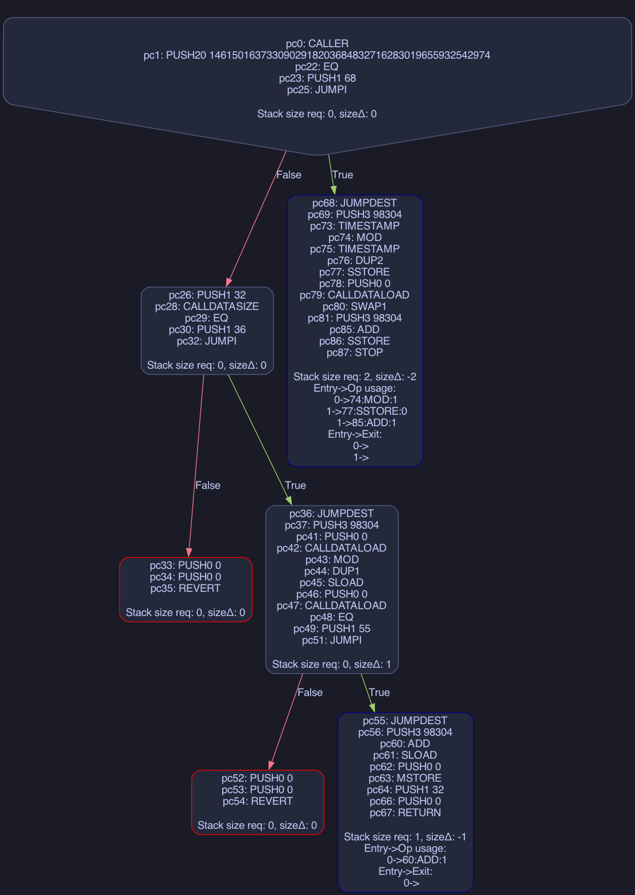

# `4788asm`

This is an [`ekt`][etk] implementation of the EIP-4788
system contract. It is 100 bytes once assembled.

## Getting Started

To setup a dev environment capable of assembling, analyzing, and executing the
repository's assembly you will need to install [`foundry`][foundry] and
[`etk`][etk]. This can be accomplished by running:

```console
$ curl -L https://foundry.paradigm.xyz | bash
$ cargo install --features cli etk-asm etk-dasm
```

## Building

To assemble `src/main.etk` you will need to invoke `eas`:

```console
$ eas src/main.etk
3373fffffffffffffffffffffffffffffffffffffffe14604357602036146024575f5ffd5b620180005f350680545f35146037575f5ffd5b6201800001545f52595ff35b6201800042064281555f359062018000015500
```

It's also possible to remove the `etk` preproccessing by doing a roundtrip --
first assembling the program, then disassembling the program:

```console
$ disease --code 0x$(eas src/main.etk)
   0:   caller
   1:   push20 0xfffffffffffffffffffffffffffffffffffffffe
  16:   eq
  17:   push1 0x43
  19:   jumpi

  1a:   push1 0x20
  1c:   calldatasize
  1d:   eq
  1e:   push1 0x24
  20:   jumpi

  21:   push0
  22:   push0
  23:   revert

  24:   jumpdest
  25:   push3 0x018000
  29:   push0
  2a:   calldataload
  2b:   mod
  2c:   dup1
  2d:   sload
  2e:   push0
  2f:   calldataload
  30:   eq
  31:   push1 0x37
  33:   jumpi

  34:   push0
  35:   push0
  36:   revert

  37:   jumpdest
  38:   push3 0x018000
  3c:   add
  3d:   sload
  3e:   push0
  3f:   mstore
  40:   msize
  41:   push0
  42:   return

  43:   jumpdest
  44:   push3 0x018000
  48:   timestamp
  49:   mod
  4a:   timestamp
  4b:   dup2
  4c:   sstore
  4d:   push0
  4e:   calldataload
  4f:   swap1
  50:   push3 0x018000
  54:   add
  55:   sstore
  56:   stop
```

### Control-flow Graph

There are several tools to generate a control-flow graph. We'll demostrate
[`evm-cfg`][evm-cfg] here:

```console
evm-cfg $(eas src/main.etk) | dot -Tpng -o cfg.png
```

*note: you will also need [`graphviz`][graphviz] installed to use the `dot` utility.*

###### `cfg.png`


## Testing

The tests can be executed using the `builder-wrapper` script with the same
arguments as [forge][forge]:

```console
$ ./build-wrapper test
[⠆] Compiling...
No files changed, compilation skipped

Running 2 tests for test/Contract.t.sol:ContractTest
[PASS] testRead() (gas: 18514)
[PASS] testUpdate() (gas: 53953)
Test result: ok. 2 passed; 0 failed; 0 skipped; finished in 3.35ms
Ran 1 test suites: 2 tests passed, 0 failed, 0 skipped (2 total tests)
```

A step-by-step debugger can be brought up using `./build-wrapper test --debug {test name}`.

[cfg]: https://en.wikipedia.org/wiki/Control-flow_graph
[etk]: https://github.com/quilt/etk
[evm-cfg]: https://github.com/plotchy/evm-cfg
[forge]: https://github.com/foundry-rs/foundry/blob/master/forge
[foundry]: https://getfoundry.sh/
[graphviz]: https://graphviz.org/download/
